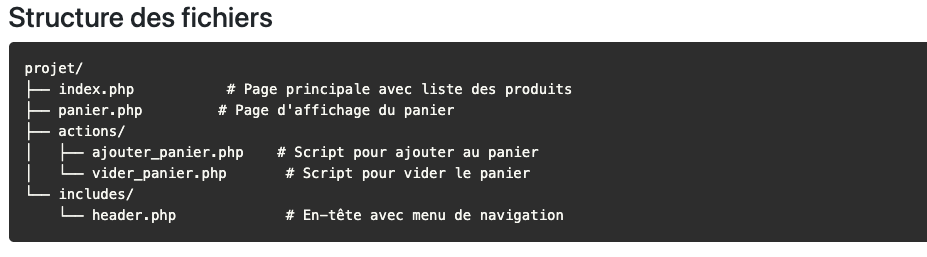
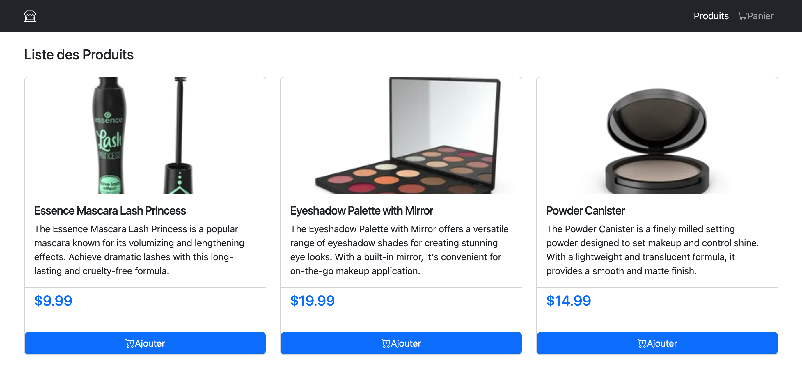
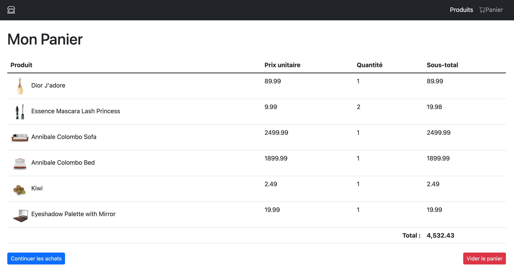

# cookies-serialize-unserialize-setcookie-php-ecommerce
<h3>Points clés   </h3>
<ul>
<li>Sessions PHP : Utilisez session_start() en début de chaque page </li>
<li>Stockage : Les données de session sont stockées sur le serveur </li>
<li>Superglobale: $_SESSION est accessible partout après session_start()</li>
<li> Bootstrap : Utilisez les classes responsives (col-md, col-lg) pour l'adaptabilité</li>
<li> Sécurité : Utilisez htmlspecialchars() pour éviter les injections XSS </li>
</ul>

à retenir

Superglobale :

